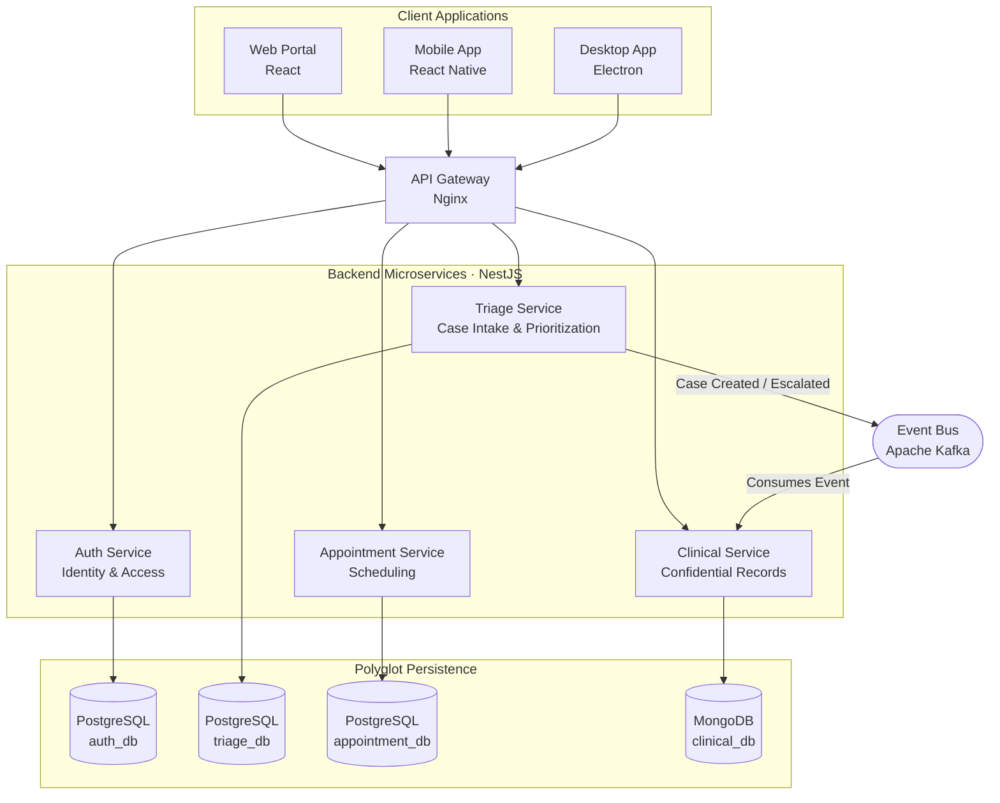
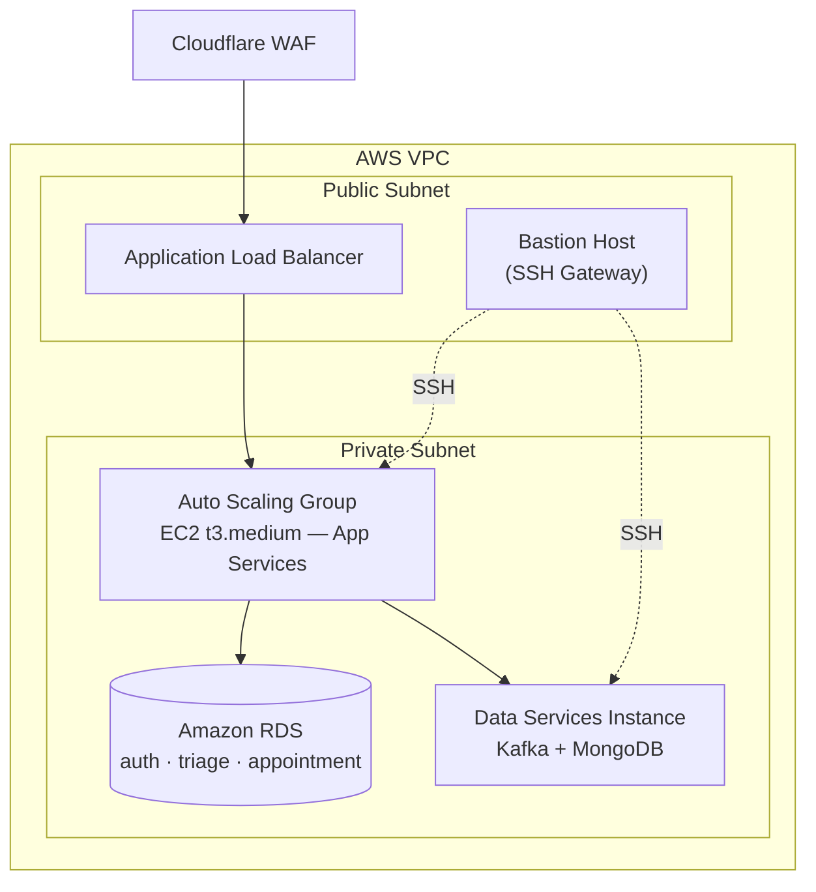

# CareUCE

### Integrated Student Support System · Central University of Ecuador

**A resilient, event-driven platform that unifies Psychology, Social Work, and Psychopedagogy services — enabling immediate crisis response while protecting medical confidentiality by design.**

**[Overview](#-overview)** · **[Features](#-key-features)** · **[Screenshots](#-screenshots)** · **[Architecture](#-architecture)** · **[Tech Stack](#-tech-stack)** · **[Infrastructure](#-cloud-infrastructure)** · **[Team](#-team)**

---

## Overview

**CareUCE** centralizes the university's student welfare services — Psychology, Social Work, and Psychopedagogy — into a single, coherent digital ecosystem. Historically operating in disconnected silos, these departments struggled to share critical information during time-sensitive situations, such as suicide-risk indicators or emergency welfare cases.

CareUCE closes that gap with a **highly available, event-driven distributed architecture** built on **Hexagonal Architecture** and **CQRS** principles, ensuring that:

- **Crisis signals travel instantly** across departments through an asynchronous event bus.
- **Clinical confidentiality is enforced architecturally**, not just procedurally — sensitive data is isolated per bounded context.
- **Each domain evolves independently**, thanks to a database-per-service microservices design.
- **Every stakeholder gets the right interface** — a web admin portal, a native mobile app for students, and a desktop client for on-site staff.

---

## Key Features

### Intelligent Triage

Every case entering the system is classified by urgency (`Alta` / `Media` / `Baja`), routed automatically, and tracked through its full lifecycle — from `Pendiente` to `Resuelto` — so no student in crisis is ever left waiting.

### Confidential Clinical Records

Psychological notes and treatment history live in an isolated, document-oriented store, linked to — but decoupled from — the triage and identity domains, preserving strict clinical confidentiality.

### Appointment Scheduling

A dedicated service manages counseling and follow-up appointments, keeping scheduling logic independent from clinical and identity data.

### Secure Identity & Access

Centralized authentication and authorization issue and validate credentials across every downstream service, using JWT-based session control.

### Multi-Platform by Design

| Platform           | Purpose                                                                                  | Stack                                  |
| ------------------ | ---------------------------------------------------------------------------------------- | -------------------------------------- |
| 🖥️ **Web Portal**  | Administrative dashboard for authorities to manage cases, students, and real-time alerts | React 18 · Atomic Design · TailwindCSS |
| 📱 **Mobile App**  | Primary touchpoint for students to reach out and follow their cases                      | React Native · Expo                    |
| 🪟 **Desktop App** | On-site tool for counselors and front-desk staff                                         | Electron                               |

---

## Screenshots

**Login**  

**Admin Dashboard** — real-time overview of active cases and alerts  

---

## Architecture

CareUCE is organized as a **domain-driven microservices ecosystem**, where each backend service owns its data and communicates state changes asynchronously — decoupling the departments that once operated in isolation.

### Guiding Architectural Principles

- **Hexagonal Architecture** — domain logic stays isolated from frameworks and infrastructure, keeping services testable and swappable.
- **CQRS** — read and write paths are modeled separately where it matters most, optimizing for both responsiveness and data integrity.
- **Database-per-Service** — each microservice owns its persistence layer, eliminating cross-service coupling and enforcing confidentiality boundaries.
- **Event-Driven Communication** — Kafka propagates domain events (e.g., a new triage case) so dependent services react without tight synchronous coupling.

---

## Tech Stack

**Backend & Services**

**Client Applications**

**Data & Messaging**

**Infrastructure & Tooling**

This project is structured as an **Nx Monorepo**, sharing interfaces and tooling across every application while keeping build and CI/CD pipelines fast through affected-based task execution and remote caching.

---

## Cloud Infrastructure

CareUCE runs entirely on **AWS**, provisioned and versioned end-to-end with **Terraform** for reproducible, auditable environments across `qa` and `prod`.

- **Compute** — an Auto Scaling Group of `t3.medium` EC2 instances behind an Application Load Balancer, scaling on CPU and request-count policies.
- **Data Layer** — managed **Amazon RDS (PostgreSQL)** instances per relational service, plus a dedicated EC2 instance running Kafka and MongoDB for event streaming and document storage.
- **Network Security** — all application and data resources sit in private subnets, reachable only through the load balancer or a hardened bastion host.
- **Edge Protection** — **Cloudflare WAF** shields the platform from common web exploits and malicious traffic before it ever reaches AWS.
- **Infrastructure as Code** — every environment (`qa`, `prod`) is fully described in Terraform modules, enabling consistent, repeatable deployments.
- **CI/CD** — GitHub Actions automate linting, testing, and container builds on every pull request targeting `main`.

---

## Security & Confidentiality

- **JWT-based authentication** issued and validated centrally by the Auth Service.
- **Isolated clinical data store** — psychological notes never share a database with identity or scheduling data.
- **Least-privilege network topology** — security groups scope traffic strictly between the load balancer, application tier, and data tier.
- **Encrypted, versioned infrastructure** — no manual, undocumented changes to production resources.

---

## Team

| Role                            | Member           |
| ------------------------------- | ---------------- |
| Scrum Master / Business Analyst | Jimmy Quimba     |
| DevOpsSec / SRE                 | Donovan Pilicita |
| Back-End Developer              | Carlos Robayo    |
| Front-End / UI-UX               | Davinson Diaz    |

---

**CareUCE** — because every student's wellbeing deserves a system that responds as fast as they need it to.

© Universidad Central del Ecuador · CareUCE Project
